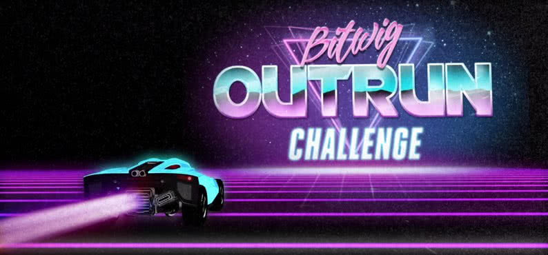

# OUTRUN
Back to the Future / Retrowave / Synthwave

## The Bitwig Community Challenge
Bitwig Challenges are small, fun, creative monthly exercises for us to put our
skills to the test. There are no prizes and no winners. Just a bunch of geeks
making cool stuff centered  around one central theme. Create anything anything
you can imagine, whether it's a lead synth, a sound effect, a tool, or an
entire song... it doesn't matter, just make it!

## Challenge Overview
* Create and submit any sound, preset, or tool that relates to the 'Outrun' Theme.
* Submissions must be made inside of Bitwig and should end up as a '.bwpreset' file.
* Enter as many times as you'd like before the 31st of July.
* There are no winners or rankings.
* Have fun and think outside of the box.
* join the discord and submit content for the next challenge

## List of participators
* coming soon? link to what?...

## More Polarity Content
I separated all my music goodies into different repositories:
- 🔥 [Bitwig Presets by Polarity](https://github.com/polarity/polarity-music-tools) - My free to use Bitwig presets (updated regulary)
- 📋 [Bitwig Projects by Polarity](https://github.com/polarity/bitwig-projects) - My free to use Bitwig projects
- 💽 [Bitwig Artist Collection](https://github.com/polarity/bitwig-artist-collection) - My official Bitwig 2.0 package
- ❤️ [Bitwig Community Presets](https://github.com/polarity/bitwig-community-presets) - presets collected from the bitwig discord
- 🎹 [Bitwig Pianobook](https://github.com/polarity/bitwig-pianobook) - different pianos sampled as bitwig presets
* 💰 check [Patreon for support](https://www.patreon.com/polarity_music)